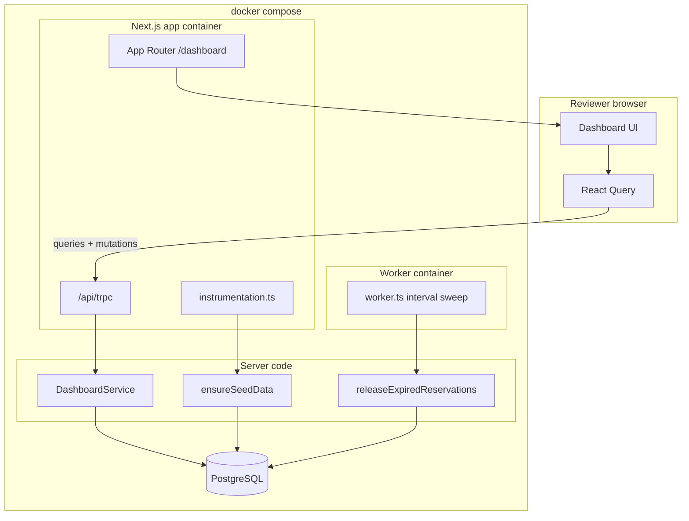

# Locale-Based Content Review Queue

End-to-end prototype for locale-scoped ticket reservation and confirmation with auto-release.

## Stack

- Next.js App Router (frontend + backend in one service)
- tRPC for API layer
- Prisma + PostgreSQL for persistence
- React Query for client state

## Project flow

High-level data and control flow (GitHub renders the Mermaid diagram below).



## Quick Start

```bash
docker compose up
```

This single command starts PostgreSQL, the Next.js app container, and the reservation release worker container. Prisma client generation and `prisma db push` run automatically before the app boots.

PostgreSQL is isolated to this project as `pipin` and is exposed on host port `5432` using `pipinuser` with password `password`.

If you change dependencies or the Dockerfile, run `docker compose up --build`.

If Docker was previously built against an older schema/config, reset and rebuild:

```bash
docker compose down -v
docker compose up --build --force-recreate
```

Seed data is defined in one place: `services/startupSeed/seed.ts` (`ensureSeedData`).

- App startup path: `instrumentation.ts` calls `ensureSeedData(prisma)`.
- CLI path: `prisma/seed.ts` calls the same `ensureSeedData(prisma)`.

Open the UI at `http://localhost:3000/dashboard`.

To stop the local stack:

```bash
docker compose down
```

## Integration tests

Integration tests hit PostgreSQL (same schema as the app). Ensure the DB is up (for example `docker compose up -d postgres`), then:

```bash
npm run prisma:generate
npm run prisma:db:push
npm run test
```

`vitest` loads `.env` via `vitest.config.ts`. Use `TEST_DATABASE_URL` if you want a separate database from `DATABASE_URL`. Run `npm run test:watch` for watch mode.

## Seeded Reviewers

- `reviewer-west-1` + `WEST_COAST`
- `reviewer-east-1` + `EAST_COAST`
- `reviewer-midwest-1` + `MIDWEST`
- `reviewer-south-1` + `SOUTH`

## Ticket Ingestion Strategy

Tickets are generated by deterministic startup bootstrap logic (`services/startupSeed/seed.ts`) on service startup.

Why this approach:

- Simple and deterministic for reviewer demos.
- Fast startup with no external dependencies.
- Reproducible queue state for testing reserve/expiry behavior.

Potential improvements:

- Replace seed script with queue ingestion from external source (S3, Kafka, DB CDC, or webhook).
- Add idempotent ingest API and dedupe keys.
- Track source metadata and ingestion timestamps.

## API Reference (tRPC procedures)

All procedures are mounted at `/api/trpc`.

- `dashboard.authenticate`
  - input: `{ reviewerCode: string, locale: Locale }`
  - validates reviewer identity for locale.
- `dashboard.availableTickets`
  - returns unassigned locale-scoped tickets.
- `dashboard.reserveTicket`
  - input: `{ ticketId: string }`
  - reserves for authenticated reviewer for 20 minutes.
- `dashboard.confirmTicket`
  - input: `{ ticketId: string }`
  - confirms active reservation before expiry.
- `dashboard.activeReservations`
  - returns all active reservations for current reviewer.
- `dashboard.metrics`
  - returns locale queue health snapshot (available, reserved, confirmed, released).

## Session Behavior

- Sign-in authenticates once through `dashboard.authenticate`.
- Reviewer session (`reviewerCode` + `locale`) is stored in a browser cookie (`review-queue-session`).
- Sign-out clears the session cookie.

## Core Design Decisions

- **Locale isolation:** Reviewers can only operate on tickets in their assigned locale.
- **Reservation window:** Each reservation expires after 20 minutes (`RESERVATION_WINDOW_MS`).
- **Auto-release path:** Stale reservations are released by the background worker only. Docker Compose service `re-queue-service` runs `npm run worker:queue` (`services/review-queue/worker.ts`, default interval 30s).
- **Release atomicity:** `releaseExpiredReservations` runs reservation + ticket updates in a single DB transaction. `instrumentation.ts` only runs seed bootstrap (`ensureSeedData`), not the release worker.
- **Concurrency safety:** Reservation is performed in a transaction and guarded with conditional `updateMany` to avoid double-claim race.
- **Dashboard refresh:** React Query polls dashboard queries every 3 seconds.
- **Data model separation:** `Ticket`, `Reviewer`, `Reservation` are modeled independently; `Ticket` points to its current reservation.

## Assumptions

- One active reservation per ticket.
- Confirmed tickets are terminal for this prototype.
- Reviewer authentication is simulated with seeded reviewer identity.

## Future Scope

- Add explicit ticket completion endpoint and metrics.
- Add more integration tests (metrics, polling cadence behavior).
- Add horizontal scale support using external lock or queue.
- Remove polling-based dashboard refresh and move to push updates.
- Implement either WebSocket or SSE for real-time queue updates.
- Keep React Query invalidation on pushed events so UI refreshes immediately.
- Add reconnect handling and fallback polling only during temporary disconnects.

## LLM Usage Disclosure

LLM assistance was used for implementation acceleration:

- Initial project scaffolding and endpoint wiring.
- Drafting parts of README and UI copy.

All generated code was reviewed and manually adjusted for assignment requirements.


https://github.com/user-attachments/assets/93236dfc-4476-477f-9b92-807cac41595f


